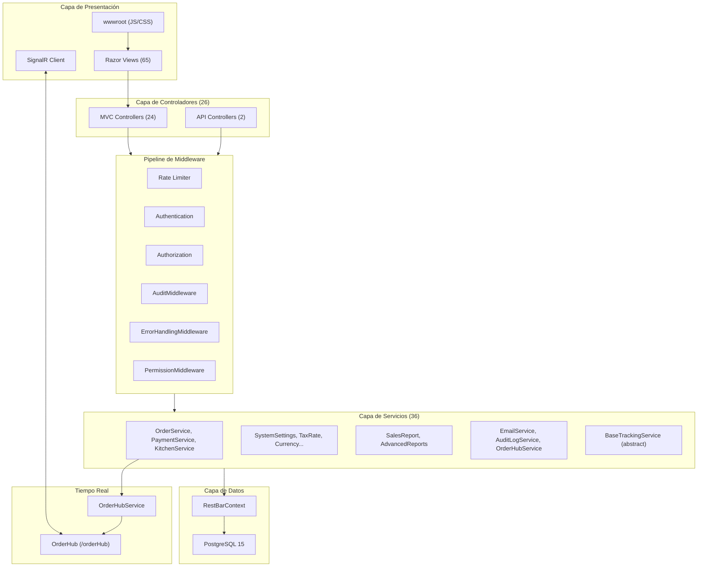

# 02 — Architecture Analysis

**Sistema:** RestBar  
**Fecha:** 2026-07-04

---

## 1. Estilo Arquitectónico

RestBar implementa un **monolito modular** basado en ASP.NET Core MVC con las siguientes características:

| Característica | Implementación |
|----------------|----------------|
| Estilo | Layered Monolith (3 capas lógicas) |
| Presentación | Razor Views + AJAX/JSON endpoints |
| Lógica de negocio | Service Layer (scoped DI) |
| Persistencia | EF Core DbContext directo (sin Repository pattern) |
| Comunicación real-time | SignalR Hub |
| Autenticación | Cookie-based (stateful) |

No se observan patrones CQRS, Event Sourcing, ni microservicios.

---

## 2. Diagrama Lógico de la Solución



---

## 3. Frameworks y Tecnologías

### 3.1 Backend

| Componente | Paquete/Versión |
|-----------|-----------------|
| ASP.NET Core Web | net8.0 |
| EF Core | 9.0.5 |
| Npgsql EF Provider | 9.0.4 |
| SignalR | 1.1.0 |
| BCrypt | 4.0.3 |
| MailKit | 4.14.1 |

**Nota de compatibilidad:** EF Core 9 sobre .NET 8 — funcional pero fuera de la matriz estándar de versiones emparejadas de Microsoft.

### 3.2 Frontend

| Componente | Fuente |
|-----------|--------|
| Bootstrap 5 | wwwroot/lib |
| jQuery 3.x | wwwroot/lib |
| jQuery Validation | wwwroot/lib |
| DataTables | CDN |
| SweetAlert2 | CDN |
| Font Awesome | CDN |
| SignalR Client | CDN (cdnjs/unpkg) |
| Google Fonts (Inter) | CDN |

### 3.3 Infraestructura

| Componente | Detalle |
|-----------|---------|
| Contenedorización | Multi-stage Dockerfile (.NET 8 SDK → aspnet runtime) |
| Orquestación | docker-compose (web + postgres) |
| Reverse proxy | nginx con SSL (Let's Encrypt) |
| Data Protection | Volumen Docker para claves de cookie |

---

## 4. Patrones de Diseño Identificados

| Patrón | Ubicación | Descripción |
|--------|-----------|-------------|
| **Service Layer** | `Services/*.cs` | Toda lógica de negocio encapsulada en servicios scoped |
| **Dependency Injection** | `Program.cs` | Registro explícito de 36 pares interface→implementación |
| **Template Method** | `BaseTrackingService` | Clase abstracta con tracking automático de Created/Updated |
| **DTO/ViewModel** | `ViewModel/`, `ViewModels/` | Separación parcial entre entidades y modelos de vista |
| **Middleware Pipeline** | `Middleware/` | Cross-cutting concerns (audit, error, permission) |
| **Hub/Spoke (SignalR)** | `OrderHub` + `OrderHubService` | Publicación de eventos a grupos de clientes |
| **Optimistic Concurrency** | `Order.Version` | Token de concurrencia en órdenes |
| **Idempotency Key** | `Payment.IdempotencyKey` | Prevención de pagos duplicados |
| **Multi-Tenant Filtering** | Servicios con `IHttpContextAccessor` | Filtrado por claims BranchId/CompanyId |

### Patrones NO utilizados

- Repository Pattern
- Unit of Work explícito
- CQRS / MediatR
- Domain Events
- Outbox Pattern
- API Gateway
- Background Job Queue (Hangfire/Quartz)

---

## 5. Pipeline HTTP (Orden de Ejecución)

```
1.  UseDeveloperExceptionPage / UseExceptionHandler (prod)
2.  UseHttpsRedirection
3.  UseStaticFiles (+ cache busting en dev)
4.  UseRouting
5.  UseRateLimiter
6.  UseSession
7.  UseAuthentication
8.  UseAuthorization
9.  UseAuditLogging()        → AuditMiddleware
10. UseErrorHandling()       → ErrorHandlingMiddleware
11. UsePermissionValidation() → PermissionMiddleware
12. MapControllerRoute
13. MapHub<OrderHub>("/orderHub")
```

---

## 6. Capas de Autorización (Defensa en Profundidad)

```
Capa 1: [Authorize] / Políticas ASP.NET (controller/action level)
Capa 2: PermissionMiddleware (path → action mapping)
Capa 3: AuthService.HasPermissionAsync (role → action matrix)
Capa 4: Branch/Company IDOR checks (ad hoc en controllers API)
Capa 5: SuperAdmin bypass (middleware)
```

**Inconsistencia:** Las rutas `/api/*` omiten PermissionMiddleware pero dependen de políticas ASP.NET. Las rutas MVC pasan por ambas capas.

---

## 7. Modelo de Concurrencia

| Mecanismo | Ámbito |
|-----------|--------|
| `Order.Version` (int, concurrency token) | Actualizaciones de orden y pagos |
| `DbUpdateConcurrencyException` → HTTP 409 | PaymentController |
| Índice parcial `idx_unique_active_order_per_table` | Una orden activa por mesa (DB) |
| Índice parcial `idx_payments_idempotency_key` | Pagos duplicados (DB) |
| Transacciones explícitas | PaymentService, OrderService |

---

## 8. Comunicación en Tiempo Real

### Arquitectura SignalR

```
OrderHubService (server-side)
    ↓ IHubContext<OrderHub>
OrderHub (/orderHub)
    ↓ Groups
Clientes suscritos:
  - order_{orderId}
  - table_{tableId}
  - table_all
  - kitchen
  - orders
  - station_{stationType}
  - stock_updates
```

### Eventos emitidos

| Evento | Origen típico |
|--------|--------------|
| `OrderStatusChanged` | OrderService |
| `OrderItemStatusChanged` | OrderService, KitchenService |
| `OrderItemUpdated` | OrderService |
| `OrderCancelled` | OrderService |
| `OrderCompleted` | PaymentService |
| `TableStatusChanged` | OrderService, TableService |
| `NewOrder` | OrderService |
| `KitchenUpdate` | KitchenService |
| `PaymentProcessed` | PaymentService |

### Recuperación post-desconexión

- Cliente KDS: `GET /api/kitchen/current` (autorizado con `KitchenAccess`)
- Cliente POS: re-join de grupos en `onreconnected`

---

## 9. Estrategia de Persistencia

| Aspecto | Decisión |
|---------|----------|
| ORM | EF Core Code-First |
| Migraciones | 5 migraciones aplicadas; auto-migrate en producción |
| Tracking automático | `ITrackableEntity` → `ApplyTrackingChanges()` en SaveChanges |
| Enums PostgreSQL | `UserRole` mapeado; otros enums registrados pero columnas usan varchar |
| JSON en DB | jsonb para `AssignedTableIds`, audit OldValues/NewValues |
| Naming | Mixto snake_case / PascalCase (inconsistencia) |

---

## 10. Escalabilidad y Limitaciones Arquitectónicas

| Limitación | Impacto |
|-----------|---------|
| Monolito single-instance | Sin escalado horizontal nativo de SignalR sin backplane |
| Session en memoria (DistributedMemoryCache) | No compartida entre instancias |
| Sin cola de mensajes | Operaciones síncronas únicamente |
| Sin CDN para assets propios | Dependencia de CDN externos para librerías |
| Sin API versioning | Cambios breaking afectan clientes directamente |
| Sin health checks formales | Solo healthcheck de PostgreSQL en Docker |

---

## 11. Decisiones Arquitectónicas Relevantes para Certificación

1. **Cookie auth** implica que toda certificación E2E debe manejar sesiones de navegador.
2. **Filtrado multi-tenant en código** requiere pruebas de aislamiento por Company/Branch en cada módulo.
3. **Híbrido MVC+JSON** significa que muchos "endpoints" no son REST puros sino acciones MVC que retornan JSON.
4. **SignalR sin autorización en Hub** es un hallazgo de seguridad que afecta la arquitectura de confianza.
5. **Sin background jobs** implica que backup, notificaciones diferidas y procesos batch no existen.

---

*Documento de análisis arquitectónico. Sin modificaciones al sistema.*
