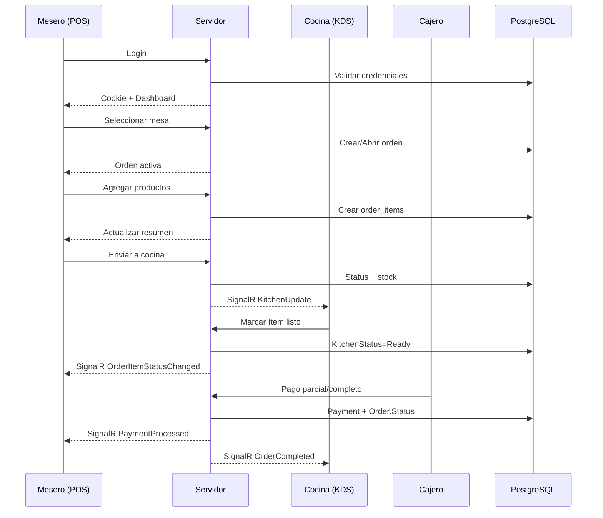

# 05 — Complete Functional Flows

**Sistema:** RestBar  
**Fecha:** 2026-07-04

Flujos funcionales completos identificados en el código, incluyendo procesos secundarios.

---

## FL-01 — Autenticación (Login)

```
Usuario accede a /Auth/Login (default route)
  ↓
[GET] Renderiza Login.cshtml (_LoginLayout)
  ↓
[POST] Credenciales (email + password)
  ↓
Rate Limiter (5 req/min/IP) — si excede → 429 JSON
  ↓
[ValidateAntiForgeryToken]
  ↓
AuthService.LoginAsync()
  ├── Buscar usuario por email
  ├── Verificar IsActive = true
  ├── Verificar PasswordHash no es RESET_TOKEN
  ├── Verificar password (BCrypt o legacy SHA256)
  ├── Si legacy → migrar a BCrypt
  ├── Crear ClaimsIdentity (UserId, UserRole, BranchId, CompanyId, etc.)
  └── SignInAsync (cookie RestBarAuth, 8h sliding)
  ↓
AuditMiddleware registra REQUEST_SUCCESS
  ↓
Redirect según rol:
  ├── superadmin → /SuperAdmin/Index
  └── otros → /Home/Index
```

### FL-01b — Logout

```
POST /Auth/Logout
  ↓
[ValidateAntiForgeryToken]
  ↓
SignOutAsync (elimina cookie)
  ↓
Redirect → /Auth/Login
```

### FL-01c — Recuperación de Contraseña

```
GET /Auth/ForgotPassword → formulario
  ↓
POST email → AuthService
  ├── Generar token
  ├── Almacenar en PasswordHash como RESET_TOKEN:{token}:{expiry}
  ├── EmailService.SendPasswordRecoveryAsync() (si Email:Enabled)
  └── Retornar mensaje genérico (no revelar si email existe)
  ↓
GET /Auth/ResetPassword?token=... → formulario
  ↓
POST nueva password → validar token → BCrypt hash → actualizar user
```

---

## FL-02 — Dashboard y Navegación Inicial

```
GET /Home/Index [Authorize]
  ↓
Leer claims: UserRole, BranchName, CompanyName
  ↓
GetVisibleCardsForRole(role) → CardVisibility
  ↓
StationService.GetStationTypes() → cards dinámicas KDS
  ↓
Renderizar Home/Index con cards filtradas por rol
  ↓
Usuario selecciona módulo → navega a ruta correspondiente
  ↓
PermissionMiddleware valida path → action → HasPermissionAsync
  ├── Sin permiso → /Auth/AccessDenied
  └── Con permiso → controller action
```

---

## FL-03 — Ciclo Completo de Orden (POS)

### FL-03a — Apertura de Orden

```
GET /Order/Index [OrderAccess]
  ↓
Renderiza POS (_OrderLayout) + partials + JS modules
  ↓
JS: tables.js → GET /Order/GetActiveTables
  ↓
Usuario selecciona mesa
  ↓
JS: GET /Order/GetActiveOrder/{tableId}
  ├── Si existe orden activa → cargar ítems
  └── Si no existe → POST crear orden nueva
        ↓
        OrderService.CreateOrderAsync()
          ├── Validar mesa disponible (idx_unique_active_order_per_table)
          ├── Crear Order (Status=Pending, Version=0)
          ├── Actualizar Table.Status = Ocupada
          └── SignalR: TableStatusChanged
```

### FL-03b — Agregar Productos

```
Usuario selecciona categoría → GET /Order/GetProductsByCategory/{id}
  ↓
Usuario click en producto
  ↓
JS: categories.js → GET /Order/CheckItemStockAvailability
  ├── Stock insuficiente → alerta
  └── Stock OK ↓
POST /Order/AddItems (JSON: orderId, items[])
  ↓
OrderService.AddItemsToOrderAsync()
  ├── Crear OrderItems (Status=Pending)
  ├── Calcular TotalAmount
  ├── Incrementar Order.Version
  └── SignalR: OrderItemUpdated
```

### FL-03c — Enviar a Cocina

```
POST /Order/SendToKitchen (orderId)
  ↓
OrderService.SendToKitchenAsync()
  ├── Order.Status → SentToKitchen
  ├── OrderItems.KitchenStatus → Sent
  ├── Asignar PreparedByStationId (via ProductStockAssignment)
  ├── Decrementar stock (si TrackInventory)
  ├── Table.Status → EnPreparacion
  └── SignalR: KitchenUpdate, OrderStatusChanged, NewOrder
  ↓
KDS (StationOrders) recibe actualización en tiempo real
```

### FL-03d — Preparación en Cocina (KDS)

```
GET /Order/StationOrders?stationType=kitchen [OrderAccess + kitchen perm]
  ↓
Renderiza KDS (_KitchenLayout) + signalr.js
  ↓
JS: initializeStationSignalR() → join station_kitchen group
  ↓
OrderService.GetKitchenOrdersAsync(stationType)
  ↓
Chef marca ítem listo → POST /Order/MarkItemReady
  ↓
OrderService.MarkItemReadyAsync()
  ├── OrderItem.KitchenStatus → Ready
  ├── Si todos listos → Order.Status → Ready
  └── SignalR: OrderItemStatusChanged, KitchenUpdate
  ↓
POS recibe actualización → UI refleja estado
```

### FL-03e — Aplicar Descuento

```
Usuario abre modal descuento (discounts.js)
  ↓
Selecciona tipo (% o monto fijo)
  ↓
POST /Order/UpdateOrderComplete (con discount)
  ↓
OrderService actualiza TotalAmount
```

### FL-03f — Cancelación de Orden

```
POST /Order/Cancel (orderId, reason)
  ↓
OrderService.CancelOrderAsync()
  ├── Order.Status → Cancelled
  ├── Crear OrderCancellationLog
  ├── Table.Status → Disponible
  ├── Restaurar stock (si aplica)
  └── SignalR: OrderCancelled, TableStatusChanged
```

---

## FL-04 — Flujo de Pagos

### FL-04a — Pago Parcial

```
Desde POS → payments.js → modal de pago
  ↓
POST /api/Payment/partial [PaymentAccess]
  Body: { orderId, amount, method, payerName?, idempotencyKey? }
  ↓
PaymentController:
  ├── Validar branch IDOR (order.BranchId == user.BranchId)
  ├── Verificar idempotencyKey (si existe, retornar pago existente)
  ├── Iniciar transacción DB
  ├── Re-leer Order con Version (concurrencia)
  ├── Calcular totalPaid + newAmount vs TotalAmount
  ├── Crear Payment record
  ├── Si totalPaid >= TotalAmount:
  │     ├── Order.Status → Completed
  │     ├── Table.Status → Pagada → Disponible
  │     ├── EmailService.SendOrderConfirmation (si habilitado)
  │     └── SignalR: OrderCompleted, PaymentProcessed
  ├── Si parcial:
  │     ├── Order.Status → ReadyToPay
  │     └── Table.Status → ParaPago
  └── Commit transacción
  ↓
Retornar JSON: { success, paymentId, remainingBalance, warningCode? }
```

### FL-04b — Pago con Split (Cuentas Separadas)

```
FL-03 + FL-06 (crear personas)
  ↓
payments.js → validateSplitPayments()
  ↓
POST /api/Payment/partial con IsShared=true
  ↓
SplitPaymentService crea SplitPayment records por persona
  ↓
Mismo flujo de actualización de orden/mesa
```

### FL-04c — Anulación de Pago (Void)

```
DELETE /api/Payment/{paymentId} [PaymentAccess]
  ↓
PaymentService.VoidPaymentAsync()
  ├── Payment.IsVoided = true
  ├── Recalcular totalPaid de la orden
  ├── Revertir Order.Status si necesario
  └── SignalR: PaymentProcessed
```

### FL-04d — Resumen de Pagos

```
GET /api/Payment/order/{orderId}/summary
  ↓
Retorna: totalAmount, totalPaid, remainingBalance, payments[], warningCode
```

---

## FL-05 — Cuentas Separadas (Split Bill)

```
POST /Person/CreatePerson [OrderAccess]
  Body: { orderId, name }
  ↓
PersonService.CreatePersonAsync()
  ├── Validar order pertenece a branch del usuario
  └── Crear Person record
  ↓
GET /Person/GetPersonsByOrder/{orderId}
  ↓
JS: separate-accounts-simple.js
  ├── Mostrar modal con personas
  ├── Asignar ítems a persona (OrderItem.AssignedToPersonId)
  └── Pagos individuales por persona
```

---

## FL-06 — Gestión de Mesas

### FL-06a — CRUD Mesa

```
GET /Table/Index → renderiza UI
  ↓
GET /Table/GetTables → JSON lista
  ↓
POST /Table/Create → TableService.CreateAsync()
PUT /Table/Edit/{id} → TableService.UpdateAsync()
DELETE /Table/Delete/{id} → TableService.DeleteAsync()
```

### FL-06b — Liberar Mesas Fantasma

```
POST /Table/ReleaseGhostTables
  ↓
TableService: buscar mesas Status=Ocupada sin orden activa
  ↓
Actualizar Status → Disponible
```

### FL-06c — Corrección de Estado

```
GET /Table/FixTableStatus
  ↓
Operación correctiva: sincronizar estado mesa con órdenes activas
```

---

## FL-07 — Gestión de Productos e Inventario

### FL-07a — CRUD Producto

```
GET /Product/Index → UI
  ↓
GET /Product/GetProducts → JSON
  ↓
POST /Product/Create → ProductService (con CategoryId, Price, Stock, etc.)
PUT /Product/Edit/{id}
DELETE /Product/Delete/{id}
```

### FL-07b — Asignación Stock-Estación

```
GET /ProductStockAssignment/Index
  ↓
GET /ProductStockAssignment/GetAssignments
  ↓
POST /ProductStockAssignment/Create
  Body: { productId, stationId, stock, minStock, priority }
  ↓
ProductStockAssignmentService.CreateAsync()
  ↓
Índice único: (product_id, station_id, branch_id)
```

### FL-07c — Alertas de Stock Bajo

```
GET /Inventory/Index
  ↓
GET /Inventory/GetLowStockProducts
  ↓
Filtrar productos donde Stock <= MinStock (por branch)
  ↓
GET /Inventory/ConsumptionReport?startDate&endDate&stationId
  ↓
Reporte de consumo basado en order_items completados
```

---

## FL-08 — Gestión de Usuarios

```
GET /User/UserManagement [UserManagement]
  ↓
GET /User/GetUsers (filtros: role, branch, active)
  ↓
POST /User/Create
  ├── Validar email único
  ├── BCrypt hash password
  ├── Asignar BranchId, Role
  └── GlobalLoggingService.LogActivity
  ↓
POST /User/Update / DELETE /User/Delete/{id}
```

### FL-08b — Asignación de Personal

```
GET /UserAssignment/Index
  ↓
POST /UserAssignment/CreateAssignment
  Body: { userId, stationId?, areaId?, assignedTableIds[] }
  ↓
UserAssignmentService → user_assignments (jsonb para table IDs)
```

---

## FL-09 — Multi-Tenant (SuperAdmin)

```
GET /SuperAdmin/Index [superadmin]
  ↓
Dashboard global: contadores de companies, branches, users
  ↓
GET /SuperAdmin/Companies → CRUD compañías
GET /SuperAdmin/Branches → CRUD sucursales (por compañía)
GET /SuperAdmin/CreateAdmin → crear admin para compañía
  ↓
PermissionMiddleware: bypass total para superadmin
```

---

## FL-10 — Reportes

### FL-10a — Reporte de Ventas

```
GET /Reports/Index [ReportAccess]
  ↓
GET /Reports/SalesReport?startDate&endDate
  ↓
SalesReportService.GetSalesReportAsync()
  ├── Filtrar por BranchId/CompanyId
  └── Agregar: total ventas, cantidad órdenes, promedio
  ↓
GET /Reports/ExportPdf / ExportExcel
```

### FL-10b — Reportes Avanzados

```
GET /AdvancedReports/Index
  ↓
Sub-reportes (cada uno con su vista + endpoint JSON):
  ├── ProfitabilityAnalysis → GetProductProfitability, GetCategoryProfitability
  ├── SalesAnalysis → GetTopSellingProducts, GetTopSellingCategories
  ├── CustomerAnalysis → GetTopCustomers, GetCustomerSegments
  ├── OperationalAnalysis → GetStationPerformance, GetTableUtilization
  ├── InventoryAnalysis → GetInventoryAnalysis
  ├── TrendAnalysis → GetTrendAnalysis
  ├── AuditReport → GetAuditReport
  └── SystemHealth → GetSystemHealth
  ↓
ExportToPdf / ExportToExcel (compartido)
```

---

## FL-11 — Configuración del Sistema

```
GET /AdvancedSettings/Index [ManagerOrAbove]
  ↓
Sub-secciones:
  ├── SystemSettings → CRUD key-value por CompanyId
  ├── Currency → CRUD monedas
  ├── TaxRate → CRUD tasas de impuesto
  ├── DiscountPolicy → CRUD políticas de descuento
  ├── OperatingHours → CRUD horarios
  ├── NotificationSettings → toggles de notificación
  └── BackupSettings → configurar schedule (sin ejecución automática)
  ↓
POST /AdvancedSettings/ExecuteBackup → simulación (Task.Delay 2000)
```

---

## FL-12 — Auditoría

```
Cada request HTTP (post-auth):
  ↓
AuditMiddleware → AuditLogService.LogActivityAsync(REQUEST_START)
  ↓
Controller ejecuta acción
  ↓
AuditMiddleware → LogActivityAsync(REQUEST_SUCCESS)
  ↓
Si excepción → ErrorHandlingMiddleware → LogErrorAsync

Visualización:
GET /Audit/Index [Authorize]
  ↓
Filtros: module, action, logLevel, startDate, endDate
  ↓
AuditLogService.GetFilteredLogsAsync() → máx 1000 registros
  ↓
GET /Audit/Details/{id}
```

---

## FL-13 — Email Transaccional

```
Trigger: Pago completo de orden
  ↓
PaymentService → EmailService.SendOrderConfirmationAsync()
  ├── Verificar Email:Enabled
  ├── Verificar NotificationSettings.OrderConfirmation
  ├── Cargar EmailTemplate (OrderConfirmation)
  ├── Renderizar con datos de orden
  └── MailKit SMTP send (no bloquea pago si falla)

Trigger: Recuperación contraseña
  ↓
AuthService → EmailService.SendPasswordRecoveryAsync()

Manual: GET /Email/Index → POST /Email/TestConnection
```

---

## FL-14 — Seed de Datos Demo

```
GET /Seed/Index
  ↓
POST /Seed/SeedDemoData
  ├── Si Production → bloqueado (403)
  └── Si Development:
        ├── Company + Branch (UUIDs fijos)
        ├── Areas, Tables, Stations
        ├── Categories, Products (8)
        ├── Users (9 roles, password 123456)
        ├── EmailTemplates, SystemSettings, Currency
        └── UserAssignment demo
```

---

## FL-15 — SignalR (Cross-Cutting)

```
Cliente conecta → /orderHub
  ↓
Join groups según contexto:
  POS: order_{id}, table_{id}, table_all, orders
  KDS: station_{type}, kitchen
  Stock: stock_updates
  ↓
Server evento → OrderHubService.Notify*()
  ↓
Hub.Clients.Group(groupName).SendAsync(eventName, payload)
  ↓
Cliente handler actualiza UI
  ↓
Si desconexión:
  onreconnected → re-join groups
  KDS: GET /api/kitchen/current (snapshot)
```

---

## Diagrama de Flujo Principal (End-to-End)



---

*Flujos identificados por análisis de código. Sin ejecución de pruebas funcionales.*
