# 06 — Navigation Map

**Sistema:** RestBar  
**Fecha:** 2026-07-04

---

## 1. Punto de Entrada

| Ruta | Destino | Protección |
|------|---------|------------|
| `/` | Redirect implícito → `/Auth/Login` | Pública |
| `{controller=Auth}/{action=Login}` | Login page | Pública |

**Ruta por defecto** definida en `Program.cs`: `{controller=Auth}/{action=Login}/{id?}`

---

## 2. Mapa de Navegación Principal

### 2.1 Post-Login por Rol

```
/Auth/Login
  ├── [superadmin] → /SuperAdmin/Index
  └── [otros roles] → /Home/Index (Dashboard)
```

### 2.2 Navbar (_Layout.cshtml) — Usuarios Autenticados

```
┌─ RestBar (brand) → /Home/Index
├─ Inicio → /Home/Index
├─ Configuración ▼
│   ├─ Empresas → /Company/Index
│   ├─ Sucursales → /Branch/Index
│   ├─ Áreas → /Area/Index
│   ├─ Mesas → /Table/Index
│   ├─ ─────────
│   ├─ Categorías → /Category/Index
│   ├─ Estaciones → /Station/Index
│   └─ Productos → /Product/Index
├─ Operaciones ▼
│   ├─ Órdenes → /Order/Index
│   ├─ Cocina → /StationOrders/Index  ⚠ RUTA ROTA
│   └─ Usuarios → /User/Index
└─ Usuario ▼
    ├─ Mi Perfil → /Auth/Profile
    └─ Cerrar Sesión → POST /Auth/Logout
```

**⚠ Hallazgo:** El link "Cocina" apunta a `/StationOrders/Index` que no existe. La ruta correcta es `/Order/StationOrders?stationType=kitchen`.

### 2.3 Dashboard Cards (Home/Index) — Por Rol

| Card | Ruta | admin | manager | supervisor | waiter | cashier | chef | bartender | accountant | inventarista | support |
|------|------|-------|---------|------------|--------|---------|------|-----------|------------|-------------|---------|
| Pedidos | /Order/Index | ✅ | ✅ | ✅ | ✅ | ✅ | ❌ | ❌ | ❌ | ❌ | ❌ |
| Productos | /Product/Index | ✅ | ✅ | ❌ | ❌ | ❌ | ❌ | ❌ | ❌ | ❌ | ❌ |
| Inventario | /Inventory/Index | ✅ | ✅ | ✅ | ❌ | ❌ | ❌ | ❌ | ❌ | ✅ | ❌ |
| Stock Assign | /ProductStockAssignment/Index | ✅ | ✅ | ❌ | ❌ | ❌ | ❌ | ❌ | ❌ | ❌ | ❌ |
| Mesas | /Table/Index | ✅ | ✅ | ✅ | ✅ | ✅ | ❌ | ❌ | ❌ | ❌ | ❌ |
| Usuarios | /User/UserManagement | ✅ | ✅ | ❌ | ❌ | ❌ | ❌ | ❌ | ❌ | ❌ | ❌ |
| Asignaciones | /UserAssignment/Index | ✅ | ✅ | ✅ | ❌ | ❌ | ❌ | ❌ | ❌ | ❌ | ❌ |
| Pagos | /PaymentView/Index | ✅ | ✅ | ✅ | ❌ | ✅ | ❌ | ❌ | ❌ | ❌ | ❌ |
| Ajustes | /AdvancedSettings/Index | ✅ | ✅ | ❌ | ❌ | ❌ | ❌ | ❌ | ❌ | ❌ | ❌ |
| Rep. Avanzados | /AdvancedReports/Index | ✅ | ✅ | ❌ | ❌ | ❌ | ❌ | ❌ | ❌ | ❌ | ❌ |
| Reportes | /Reports/Index | ✅ | ✅ | ❌ | ❌ | ❌ | ❌ | ❌ | ✅ | ❌ | ❌ |
| Categorías | /Category/Index | ✅ | ✅ | ❌ | ❌ | ❌ | ❌ | ❌ | ❌ | ❌ | ❌ |
| Estaciones | /Station/Index | ✅ | ✅ | ❌ | ❌ | ❌ | ❌ | ❌ | ❌ | ❌ | ❌ |
| Áreas | /Area/Index | ✅ | ✅ | ✅ | ❌ | ❌ | ❌ | ❌ | ❌ | ❌ | ❌ |
| Compañías | /Company/Index | ✅ | ❌ | ❌ | ❌ | ❌ | ❌ | ❌ | ❌ | ❌ | ❌ |
| Sucursales | /Branch/Index | ✅ | ✅ | ❌ | ❌ | ❌ | ❌ | ❌ | ❌ | ❌ | ❌ |
| KDS (dinámico) | /Order/StationOrders?stationType={type} | ✅ | ✅ | ✅ | ✅ | ✅ | ✅ | ✅ | ❌ | ❌ | ❌ |
| SuperAdmin | /SuperAdmin/* | ❌* | ❌ | ❌ | ❌ | ❌ | ❌ | ❌ | ❌ | ❌ | ❌ |

*Solo visible para rol `superadmin` (card SecurityAdmin).

---

## 3. Rutas Protegidas — Matriz de Acceso

### 3.1 Rutas Públicas (sin autenticación)

| Ruta | Middleware | Política |
|------|-----------|----------|
| `/Auth/Login` | Excluida | AllowAnonymous |
| `/Auth/AccessDenied` | Excluida | AllowAnonymous |
| `/Auth/ForgotPassword` | Excluida | AllowAnonymous |
| `/Auth/ResetPassword` | Excluida | AllowAnonymous |
| `/Home/Error` | Excluida | AllowAnonymous |
| `/css/*`, `/js/*`, `/lib/*`, `/images/*` | Excluida | — |
| `/Seed/SeedDemoData` | Parcial | AllowAnonymous (bloqueado en prod) |
| `/Seed/CreateAdminUser` | Parcial | AllowAnonymous ⚠ |
| `/Auth/CreateAdmin` | Parcial | AllowAnonymous ⚠ |

### 3.2 Rutas con Políticas ASP.NET

| Ruta prefix | Política | Roles |
|------------|----------|-------|
| `/Order/*` | OrderAccess | admin, manager, supervisor, waiter, cashier |
| `/api/kitchen/*` | KitchenAccess | admin, manager, supervisor, chef, bartender |
| `/api/Payment/*` | PaymentAccess | admin, manager, supervisor, cashier, accountant |
| `/PaymentView/*` | PaymentAccess | (mismos) |
| `/Inventory/*` | InventoryAccess | admin, manager, supervisor, accountant, inventarista |
| `/Product/*` | ProductAccess | admin, manager |
| `/ProductStockAssignment/*` | ProductAccess | (mismos) |
| `/User/*`, `/UserManagement/*`, `/UserAssignment/*` | UserManagement | admin, manager, support |
| `/Reports/*`, `/AdvancedReports/*` | ReportAccess | admin, manager, accountant |
| `/Company/*`, `/Category/*`, `/Email/*` | SystemConfig | admin |
| `/AdvancedSettings/*` | ManagerOrAbove | admin, manager |
| `/SuperAdmin/*` | Roles: superadmin | superadmin |

### 3.3 Rutas con Roles Directos

| Ruta | Roles |
|------|-------|
| `/Table/*` | admin, manager, supervisor |
| `/Area/*` | admin, manager |
| `/Station/*` | admin, manager |
| `/Branch/*` | admin |

### 3.4 Rutas con Solo [Authorize]

| Ruta | Nota |
|------|------|
| `/Home/*` | Cualquier autenticado |
| `/Audit/*` | Cualquier autenticado ⚠ (debería ser más restrictivo) |
| `/Auth/Profile` | Cualquier autenticado |

---

## 4. PermissionMiddleware — Mapeo Path → Action

| Path prefix | Action requerida | Roles con acceso |
|------------|-----------------|------------------|
| `/order` | orders | admin, manager, supervisor, waiter, cashier, chef*, bartender* |
| `/stationorders` | kitchen | admin, manager, supervisor, chef, bartender |
| `/payment` | payments | admin, manager, supervisor, cashier, accountant |
| `/table` | tables | admin, manager, supervisor, waiter, cashier |
| `/product` | products | admin, manager |
| `/user` | users | admin, manager, support |
| `/report` | reports | admin, manager, accountant |
| `/company` | admin_only | admin |
| `/branch` | admin_only | admin |
| `/category` | admin_only | admin |
| `/area` | admin_only | admin |
| `/station` | admin_only | admin |
| `/superadmin` | superadmin_only | superadmin |
| `/inventory` | — (sin mapeo) ⚠ | Solo política ASP.NET |
| `/api/*` | — (sin mapeo) | Solo política ASP.NET |

*chef y bartender tienen acceso "orders" y "kitchen" pero no "tables" ni "payments" en la matriz de AuthService.

---

## 5. Rutas API (No-MVC)

| Método | Ruta | Controller | Política |
|--------|------|-----------|----------|
| POST | `/api/Payment/partial` | PaymentController | PaymentAccess |
| GET | `/api/Payment/order/{id}/summary` | PaymentController | PaymentAccess |
| GET | `/api/Payment/order/{id}` | PaymentController | PaymentAccess |
| DELETE | `/api/Payment/{paymentId}` | PaymentController | PaymentAccess |
| GET | `/api/kitchen/current` | KitchenApiController | KitchenAccess |

### SignalR Hub

| Ruta | Hub | Autenticación |
|------|-----|--------------|
| `/orderHub` | OrderHub | ⚠ Ninguna (hub sin [Authorize]) |

---

## 6. Rutas de Redirección

| Ruta | Destino |
|------|---------|
| `/Order/KitchenOrders` | `/Order/StationOrders?stationType=kitchen` |
| `/Order/BarOrders` | `/Order/StationOrders?stationType=bar` |
| No autenticado (cualquier ruta) | `/Auth/Login` |
| Sin permisos (middleware) | `/Auth/AccessDenied` |
| Sin permisos (policy) | `/Auth/AccessDenied` |

---

## 7. Rutas con Vistas Faltantes (Controller existe, View no)

| Controller Action | Ruta esperada | Estado |
|-------------------|--------------|--------|
| AdvancedSettingsController.Currencies | /AdvancedSettings/Currencies | ❌ Vista no existe |
| AdvancedSettingsController.TaxRates | /AdvancedSettings/TaxRates | ❌ |
| AdvancedSettingsController.DiscountPolicies | /AdvancedSettings/DiscountPolicies | ❌ |
| AdvancedSettingsController.OperatingHours | /AdvancedSettings/OperatingHours | ❌ |
| AdvancedSettingsController.NotificationSettings | /AdvancedSettings/NotificationSettings | ❌ |
| AdvancedSettingsController.BackupSettings | /AdvancedSettings/BackupSettings | ❌ |
| AdvancedSettingsController.Printers | /AdvancedSettings/Printers | ❌ |
| AuthController.ForgotPassword | /Auth/ForgotPassword | ❌ |
| AuthController.ResetPassword | /Auth/ResetPassword | ❌ |
| AuthController.CreateAdmin | /Auth/CreateAdmin | ❌ |
| EmailController.Index | /Email/Index | ❌ |
| OrderController.Details | /Order/Details/{id} | ❌ |
| OrderController.Create | /Order/Create | ❌ |
| OrderController.Edit | /Order/Edit/{id} | ❌ |

---

## 8. Rutas Obsoletas / Huérfanas

| Elemento | Tipo | Detalle |
|----------|------|---------|
| `/StationOrders/Index` | Ruta rota en navbar | No existe StationOrdersController |
| `Views/Payment/Index.cshtml` | Vista huérfana | PaymentController es API-only; duplica PaymentView |
| `js/accounting.js` | JS huérfano | Sin vista que lo cargue |
| `js/supplier/supplier-management.js` | JS huérfano | Sin SupplierController |
| `js/inventory/inventory-movements.js` | JS no conectado | No cargado por Inventory/Index |
| `js/order/separate-accounts.js` | JS no cargado | Versión completa; se usa separate-accounts-simple.js |
| `js/advanced-reports/customer-analysis.js` | JS faltante | Referenciado por vista pero no existe |
| `js/advanced-reports/sales-analysis.js` | JS faltante | Referenciado por vista pero no existe |
| `js/advanced-reports/operational-analysis.js` | JS faltante | Referenciado por vista pero no existe |

---

## 9. Diagrama Completo de Navegación

```mermaid
flowchart TD
    Start["/"] --> Login["/Auth/Login"]
    Login -->|superadmin| SA["/SuperAdmin/Index"]
    Login -->|otros| Home["/Home/Index"]

    Home --> Order["/Order/Index<br/>POS"]
    Home --> KDS["/Order/StationOrders<br/>KDS"]
    Home --> Product["/Product/Index"]
    Home --> Inventory["/Inventory/Index"]
    Home --> StockA["/ProductStockAssignment/Index"]
    Home --> Table["/Table/Index"]
    Home --> UserM["/User/UserManagement"]
    Home --> UserA["/UserAssignment/Index"]
    Home --> PayV["/PaymentView/Index"]
    Home --> AdvSet["/AdvancedSettings/Index"]
    Home --> AdvRep["/AdvancedReports/Index"]
    Home --> Reports["/Reports/Index"]
    Home --> Category["/Category/Index"]
    Home --> Station["/Station/Index"]
    Home --> Area["/Area/Index"]
    Home --> Company["/Company/Index"]
    Home --> Branch["/Branch/Index"]
    Home --> Audit["/Audit/Index"]
    Home --> Profile["/Auth/Profile"]

    AdvRep --> AR1["ProfitabilityAnalysis"]
    AdvRep --> AR2["SalesAnalysis"]
    AdvRep --> AR3["CustomerAnalysis"]
    AdvRep --> AR4["OperationalAnalysis"]
    AdvRep --> AR5["InventoryAnalysis"]
    AdvRep --> AR6["TrendAnalysis"]
    AdvRep --> AR7["AuditReport"]
    AdvRep --> AR8["SystemHealth"]

    SA --> SA1["Companies"]
    SA --> SA2["Branches"]
    SA --> SA3["CreateAdmin"]

    Navbar["Navbar _Layout"] --> Home
    Navbar --> ConfigDD["Config ▼"]
    Navbar --> OpsDD["Operaciones ▼"]
    ConfigDD --> Company & Branch & Area & Table & Category & Station & Product
    OpsDD --> Order
    OpsDD --> Broken["/StationOrders/Index ⚠"]
    OpsDD --> UserIdx["/User/Index"]

    Order -->|SignalR| Hub["/orderHub"]
    KDS -->|SignalR| Hub
```



---

## 10. Layouts por Sección

| Sección | Layout | Navegación visible |
|---------|--------|-------------------|
| Login, AccessDenied | `_LoginLayout` | Ninguna |
| Dashboard, Admin | `_Layout` | Navbar completo |
| POS (Order/Index) | `_OrderLayout` | Mínima (sin navbar) |
| KDS (StationOrders) | `_KitchenLayout` | Ninguna (fullscreen) |

---

*Mapa de navegación derivado de análisis de Views, Controllers y _Layout.cshtml.*
