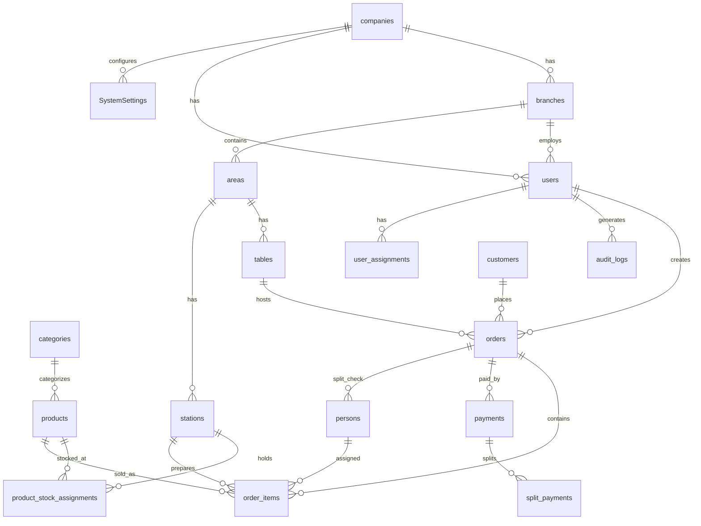

# 09 — Database Analysis

**Sistema:** RestBar  
**Fecha:** 2026-07-04

---

## 1. Resumen del Esquema

| Aspecto | Detalle |
|---------|---------|
| Motor | PostgreSQL 15 |
| ORM | Entity Framework Core 9.0.5 |
| DbContext | `RestBarContext` |
| Entidades (DbSets) | 29 |
| Migraciones | 5 |
| Enums PostgreSQL | 9 registrados (uso parcial) |
| Multi-tenancy | CompanyId + BranchId (aplicación, sin RLS) |

---

## 2. Diagrama Entidad-Relación (Dominios)



---

## 3. Tablas — Inventario Completo

### 3.1 Tablas Operacionales (snake_case)

| Tabla | PK | Campos clave | FK principales |
|-------|-----|-------------|----------------|
| `companies` | id (UUID) | name, legal_id (unique), tax_id, is_active | — |
| `branches` | id (UUID) | company_id, name, address, is_active | companies |
| `areas` | id (UUID) | branch_id, company_id, name | branches, companies |
| `tables` | id (UUID) | area_id, table_number, capacity, status, is_active | areas, branches, companies |
| `stations` | id (UUID) | area_id, name, type, icon, is_active | areas, branches, companies |
| `users` | id (UUID) | branch_id, email (unique), password_hash, role (enum), is_active | branches |
| `categories` | id (UUID) | company_id, branch_id, name, is_active | companies, branches |
| `products` | id (UUID) | category_id, price, cost, stock, min_stock, track_inventory, allow_negative_stock | categories, companies, branches |
| `product_stock_assignments` | id (UUID) | product_id, station_id, stock, min_stock, priority | products, stations, branches |
| `orders` | id (UUID) | table_id, user_id, status, total_amount, **version**, order_number | tables, users, branches, companies |
| `order_items` | id (UUID) | order_id, product_id, quantity, unit_price, status, kitchen_status, prepared_by_station_id, assigned_to_person_id | orders, products, stations, persons |
| `payments` | id (UUID) | order_id, method, amount, is_voided, **idempotency_key** | orders, branches, companies |
| `split_payments` | id (UUID) | payment_id, person_name, amount, method | payments |
| `persons` | id (UUID) | order_id, name | orders |
| `customers` | id (UUID) | full_name, email, phone, loyalty_points | companies, branches |
| `invoices` | id (UUID) | order_id, customer_id, total, tax, invoice_number, status | orders, customers |
| `modifiers` | id (UUID) | name, extra_cost, is_active | companies, branches |
| `product_modifiers` | (product_id, modifier_id) | — | products, modifiers (M:N) |
| `notifications` | id (UUID) | order_id, message, is_read | orders |
| `user_assignments` | id (UUID) | user_id, station_id, area_id, assigned_table_ids (jsonb) | users, stations, areas |
| `audit_logs` | id (UUID) | action, module, log_level, old_values (json), new_values (json), ip_address | users, companies, branches |
| `order_cancellation_logs` | id (UUID) | order_id, user_id, supervisor_id, reason, products (json) | orders, users |
| `email_templates` | id (UUID) | name, subject, body, company_id | companies |

### 3.2 Tablas de Configuración (PascalCase)

| Tabla | PK | Scope | Campos clave |
|-------|-----|-------|-------------|
| `SystemSettings` | Id (UUID) | CompanyId | Key, Value |
| `Currencies` | Id (UUID) | CompanyId | Code, Name, Symbol, ExchangeRate |
| `TaxRates` | Id (UUID) | CompanyId | Name, Rate, IsDefault |
| `DiscountPolicies` | Id (UUID) | CompanyId | Name, Type, Value, IsActive |
| `OperatingHours` | Id (UUID) | CompanyId | DayOfWeek, OpenTime, CloseTime |
| `NotificationSettings` | Id (UUID) | CompanyId | Type, IsEnabled |
| `BackupSettings` | Id (UUID) | CompanyId | Schedule (cron string), LastBackup |

### 3.3 Tabla Legacy

| Tabla | Estado |
|-------|--------|
| `product_categories` | Legacy global; superseded por `categories` (tenant-scoped) |

---

## 4. Índices y Restricciones

### 4.1 Índices Únicos

| Nombre | Tabla | Columnas | Tipo |
|--------|-------|----------|------|
| `companies_legal_id_key` | companies | legal_id | Unique |
| `users_email_key` | users | email | Unique |
| `ix_product_stock_assignments_unique` | product_stock_assignments | (product_id, station_id, branch_id) | Unique |
| `idx_payments_idempotency_key` | payments | idempotency_key | Partial unique (WHERE NOT NULL) |
| `idx_unique_active_order_per_table` | orders | table_id | Partial unique (active orders) |

### 4.2 Índices FK (60+)

Todos los FK columns tienen índices `IX_{table}_{column}` generados por InitialCreate.

### 4.3 Delete Behaviors Notables

| FK | On Delete |
|----|-----------|
| products → companies/branches | CASCADE |
| product_stock_assignments → product | CASCADE |
| product_stock_assignments → station | RESTRICT |
| products → category | SET NULL |
| persons → order | CASCADE |
| order_cancellation_logs → order | CASCADE |
| order_items → assigned_to_person | SET NULL |
| user_assignments → user | CASCADE |

---

## 5. Enums PostgreSQL

| Enum PG | Enum C# | Columna real | Uso efectivo |
|---------|---------|-------------|-------------|
| user_role_enum | UserRole | users.role | ✅ Usado |
| order_status_enum | OrderStatus | orders.status (varchar) | ⚠ Registrado, columna varchar |
| order_type_enum | OrderType | orders.order_type (varchar) | ⚠ Registrado, columna varchar |
| order_item_status_enum | OrderItemStatus | order_items.status (text) | ⚠ Registrado, columna text |
| table_status_enum | TableStatus | tables.status (varchar) | ⚠ Registrado, columna varchar |
| assignment_type_enum | AssignmentType | — | ⚠ Sin columna mapeada |
| audit_log_level_enum | AuditLogLevel | audit_logs.log_level (varchar) | ⚠ Registrado, columna varchar |
| audit_action_enum | AuditAction | audit_logs.action (text) | ⚠ Registrado, columna text |
| audit_module_enum | AuditModule | audit_logs.module (varchar) | ⚠ Registrado, columna varchar |

---

## 6. Clasificación de Tablas

### 6.1 Entidades Principales (Transaccionales)

| Tabla | Dominio |
|-------|---------|
| orders | Núcleo POS |
| order_items | Líneas de venta |
| payments | Finanzas |
| split_payments | Split bill |
| tables | Operación física |

### 6.2 Entidades de Catálogo

| Tabla | Dominio |
|-------|---------|
| companies, branches | Multi-tenant |
| categories, products, modifiers | Menú |
| stations, areas, tables | Layout |
| users, user_assignments | Personal |
| currencies, tax_rates, discount_policies | Config financiera |

### 6.3 Entidades de Auditoría

| Tabla | Tipo | Contenido |
|-------|------|-----------|
| audit_logs | General | CRUD, login, errores, security events |
| order_cancellation_logs | Dominio | Cancelaciones con aprobación supervisor |

### 6.4 Entidades con Tracking (ITrackableEntity)

~20 entidades con campos: `created_at`, `updated_at`, `created_by`, `updated_by` (auto-poblados en SaveChanges).

### 6.5 Tablas Históricas

**No existen tablas temporales ni de historial.** Los eventos se registran en:
- `audit_logs` (append-only)
- `order_cancellation_logs` (append-only)
- `payments.is_voided` (soft void, no historial)

---

## 7. Multi-Tenancy en Base de Datos

```
Company (tenant root)
  ├── Branch (sucursal)
  │     ├── Area → Table, Station
  │     ├── User (scoped to Branch)
  │     ├── Category, Product, Order, Payment... (CompanyId + BranchId)
  │     └── ProductStockAssignment
  └── Company-level config (no BranchId):
        SystemSettings, Currencies, TaxRates, DiscountPolicies,
        OperatingHours, NotificationSettings, BackupSettings, email_templates
```

**Aislamiento:** Solo a nivel aplicación (filtros en servicios). **Sin Row-Level Security (RLS)** en PostgreSQL.

**Redundancia:** Muchas tablas almacenan tanto `company_id` como `branch_id` aunque branch ya pertenece a company.

---

## 8. Evolución del Esquema (Migraciones)

| # | Migración | Fecha | Cambio |
|---|-----------|-------|--------|
| 1 | InitialCreate | 2025-11-02 | Schema completo: 30+ tablas, enums, indexes, FKs |
| 2 | AddAllowNegativeStockToProducts | 2025-11-03 | Stock fields en products + tabla product_stock_assignments |
| 3 | RemoveStationIdFromProducts | 2025-11-08 | Elimina products.station_id (migrado a assignments) |
| 4 | AddOrderVersionConcurrencyToken | 2026-02-26 | orders.version INT (optimistic concurrency) |
| 5 | SecurityHardening | 2026-02-27 | payments.idempotency_key, idx_unique_active_order_per_table, enum inventarista |

---

## 9. Inconsistencias de Naming

| Aspecto | Ejemplo |
|---------|---------|
| Tablas snake_case vs PascalCase | `orders` vs `SystemSettings` |
| Columnas mixtas | `categories.CompanyId` vs `categories.branch_id` |
| Legacy column | `products.ProductCategoryId` (FK a product_categories obsoleto) |
| Shadow column | `order_items.StationId` (model usa PreparedByStationId) |
| Duplicate fluent config | Company, Table, Payment configurados 2 veces en OnModelCreating |

---

## 10. Seed Data

| Fuente | Método | Estado |
|--------|--------|--------|
| SeedController.SeedDemoData | API (bloqueado en prod) | ✅ Actualizado |
| SeedController.CreateAdminUser | API (AllowAnonymous) | ⚠ Riesgo |
| Scripts/SeedDummyData.sql | SQL directo | ❌ Desactualizado (referencia station_id eliminado) |
| EF HasData() | — | No utilizado |

---

## 11. Datos Críticos para Certificación

| Tabla | Validación requerida en E2E |
|-------|---------------------------|
| orders + order_items | Ciclo de vida completo, concurrencia (version) |
| payments | Integridad financiera, idempotency, void |
| tables | Estados sincronizados con órdenes |
| product_stock_assignments | Impacto en KDS e inventario |
| users | Roles, branch scoping, password hashing |
| audit_logs | Trazabilidad de acciones críticas |
| idx_unique_active_order_per_table | Una orden activa por mesa |
| idx_payments_idempotency_key | No pagos duplicados |

---

*Análisis de base de datos completo. Sin modificaciones al sistema.*
