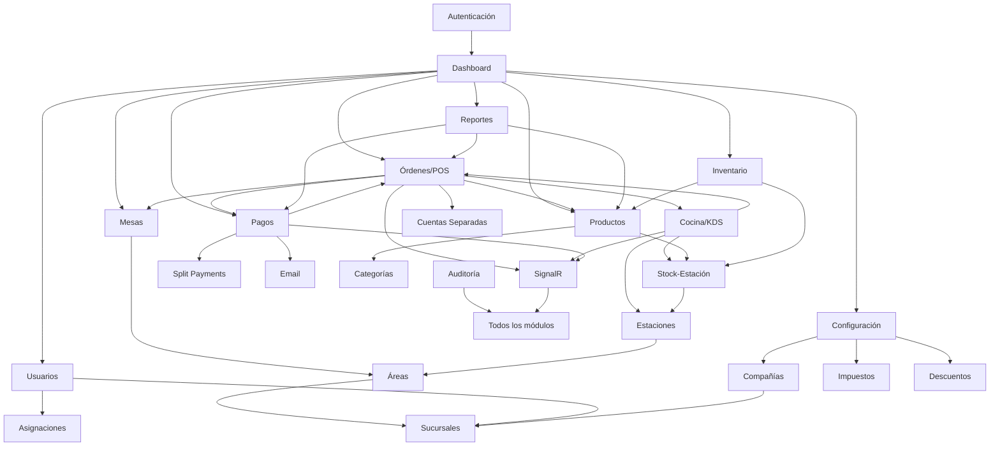

# 13 — Dependency Analysis

**Sistema:** RestBar  
**Fecha:** 2026-07-04

---

## 1. Mapa de Dependencias entre Capas

```
┌─────────────────────────────────────────────────────────┐
│                    Controllers (26)                      │
│  Dependen de: Services, ViewModels, RestBarContext      │
└────────────────────────┬────────────────────────────────┘
                         │
┌────────────────────────▼────────────────────────────────┐
│                    Services (36)                         │
│  Dependen de: RestBarContext, IHttpContextAccessor,     │
│               otros Services, ILogger, IHubContext       │
└────────────────────────┬────────────────────────────────┘
                         │
┌────────────────────────▼────────────────────────────────┐
│              RestBarContext (EF Core)                    │
│  Dependen de: PostgreSQL, HttpContextAccessor           │
└─────────────────────────────────────────────────────────┘

Cross-cutting:
  Middleware → IAuthService, IAuditLogService
  OrderHub → (standalone, invocado por OrderHubService)
  Helpers → (static, usados en Views)
```

---

## 2. Dependencias entre Módulos Funcionales



---

## 3. Dependencias de Servicios (Grafo Detallado)

### 3.1 OrderService (nodo central)

```
OrderService
  ├── RestBarContext
  ├── IOrderItemService
  ├── IProductService
  ├── ITableService
  ├── IOrderHubService
  ├── IEmailService
  └── ILogger
```

### 3.2 PaymentService

```
PaymentService
  ├── RestBarContext
  ├── IHttpContextAccessor
  ├── IOrderHubService
  ├── IEmailService
  └── IProductService (stock reversal)
```

### 3.3 AuthService

```
AuthService
  ├── RestBarContext
  ├── IUserService
  ├── IHttpContextAccessor
  └── ILogger
```

### 3.4 Servicios con HttpContextAccessor (multi-tenant)

| Servicio | Usa HttpContextAccessor para |
|----------|------------------------------|
| StationService | BranchId filtering |
| AreaService | BranchId filtering |
| BranchService | CompanyId filtering |
| UserService | BranchId filtering |
| CustomerService | BranchId filtering |
| PaymentService | BranchId IDOR check |
| PersonService | BranchId IDOR check |
| ProductStockAssignmentService | BranchId filtering |
| InvoiceService | BranchId filtering |
| NotificationService | BranchId filtering |
| AuthService | Claims reading |

---

## 4. Dependencias de Paquetes NuGet

| Paquete | Usado por | Propósito |
|---------|----------|-----------|
| Microsoft.EntityFrameworkCore 9.0.5 | RestBarContext, Services | ORM |
| Npgsql.EntityFrameworkCore.PostgreSQL 9.0.4 | RestBarContext | DB provider |
| Microsoft.AspNetCore.SignalR 1.1.0 | OrderHub, OrderHubService | Real-time |
| BCrypt.Net-Next 4.0.3 | AuthService | Password hashing |
| MailKit 4.14.1 | EmailService | SMTP |
| MimeKit 4.14.0 | EmailService | Email parsing |

### Paquetes NO presentes (dependencias ausentes)

| Paquete | Impacto |
|---------|---------|
| FluentValidation | Validación manual |
| Serilog/NLog | Logging básico ASP.NET |
| Hangfire/Quartz | Sin background jobs |
| AutoMapper | Mapeo manual |
| Swashbuckle | Sin API docs |
| Redis | Sin cache distribuido |
| JWT Bearer | Sin API token auth |

---

## 5. Dependencias Frontend

### 5.1 JS Module Dependencies (Order/POS)

```
order/Index.cshtml
  ├── utilities.js (base)
  ├── order-management.js → utilities.js
  ├── order-ui.js → order-management.js
  ├── order-operations.js → order-management.js, utilities.js
  ├── tables.js → utilities.js
  ├── categories.js → utilities.js, order-management.js
  ├── signalr.js → (standalone + SignalR CDN)
  ├── payments.js → utilities.js, order-management.js
  ├── discounts.js → order-management.js
  ├── dynamic-status.js → (standalone)
  ├── stock-updates.js → (standalone + SignalR CDN)
  └── separate-accounts-simple.js (global, _Layout)
```

### 5.2 CSS Dependencies

```
_Layout.cshtml → site.css, bootstrap, font-awesome
_OrderLayout → order.css, signalr-notifications.css
_KitchenLayout → modern-kitchen.css
Inventory/Index → inventory.css
PaymentView/Index → payment-management.css
```

---

## 6. Componentes Compartidos

| Componente | Consumidores |
|-----------|-------------|
| `_Layout.cshtml` | 50+ vistas admin |
| `utilities.js` (formatCurrency) | Todos los módulos order/ |
| `responsive-notifications.js` | Global (SweetAlert2 config) |
| `BaseTrackingService` | 15+ servicios |
| `RestBarContext` | Todos los servicios |
| `IHttpContextAccessor` | 12+ servicios + DbContext |
| `OrderHubService` | OrderService, PaymentService, KitchenService |
| `AuditLogService` | Middleware + algunos controllers |
| `GlobalLoggingService` | UserService, algunos controllers |

---

## 7. Acoplamiento Identificado

| Tipo | Detalle | Severidad |
|------|---------|-----------|
| **OrderService como God Service** | Dependencia de 6+ servicios; orquesta todo el POS | Alta |
| **RestBarContext en controllers** | Algunos controllers acceden DB directamente (SuperAdmin, Seed, Inventory) | Media |
| **HttpContextAccessor en 12+ servicios** | Multi-tenant filtering acoplado a HTTP context | Media |
| **OrderHubService acoplado a 3 servicios** | Cambios en SignalR afectan Order, Payment, Kitchen | Media |
| **Inline JS en vistas** | Lógica de UI duplicada en múltiples Index.cshtml | Media |
| **Dual category system** | categories + product_categories coexisten | Baja |
| **Interfaces en dos ubicaciones** | Interfaces/ y Services/ | Baja |

---

## 8. Dependencias de Infraestructura

```
RestBar App
  ├── PostgreSQL 15 (requerido)
  ├── Docker (producción)
  │     ├── nginx (SSL termination)
  │     └── Docker volumes (data, keys)
  ├── CDN externos (degradación graceful)
  │     ├── DataTables
  │     ├── SweetAlert2
  │     ├── Font Awesome
  │     └── SignalR client
  └── SMTP server (opcional)
```

---

## 9. Cadena de Dependencias Críticas

### Cadena POS (más crítica para el negocio)

```
Table → Order → OrderItem → Product → ProductStockAssignment → Station
                  ↓                        ↓
              Payment → SplitPayment    Stock decrement
                  ↓
              SignalR → KDS update
                  ↓
              Email (optional)
```

### Cadena Multi-Tenant

```
SuperAdmin → Company → Branch → User → UserAssignment
                                  ↓
                              All operational data (filtered by BranchId)
```

### Cadena de Seguridad

```
Login → AuthService → Cookie → Claims → PermissionMiddleware → Controller → Service → DB filter
```

---

## 10. Dependencias Circulares

**No se detectaron dependencias circulares en DI.** Todos los servicios siguen un grafo DAG (Directed Acyclic Graph).

La resolución de ciclos JSON (Order → OrderItems → Product → Category) se maneja con `ReferenceHandler.IgnoreCycles` en la serialización JSON.

---

*Análisis de dependencias completo. Sin modificaciones al sistema.*
