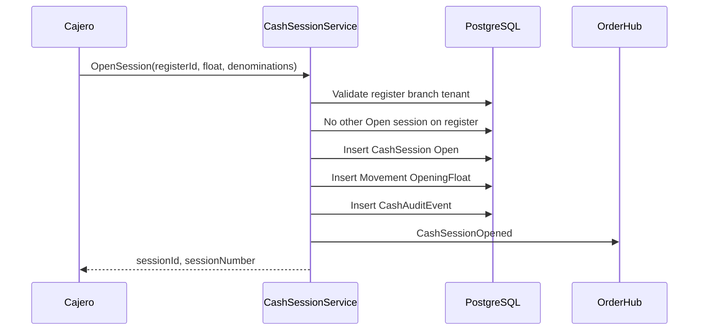
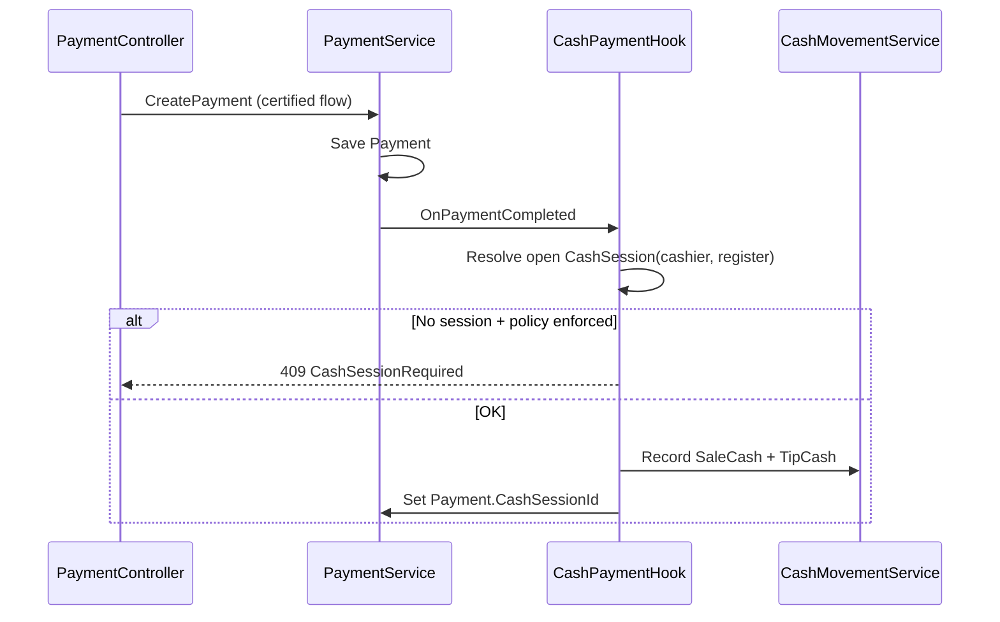

# 12 — WORKFLOWS

---

# WF-01 Apertura de caja

---

# WF-02 Cobro efectivo POS (integración)

---

# WF-03 Retiro (Paid-out)

1. Cajero solicita monto + motivo  
2. IF amount > MaxPaidOutWithoutApproval → CashApproval Pending  
3. Supervisor approves → Movement PaidOut  
4. ELSE immediate movement  

---

# WF-04 Cierre con varianza

1. Cajero inicia cierre → Status Counting  
2. Ingresa denominaciones (blind)  
3. System calcula Expected  
4. IF |variance| > threshold → Approval required  
5. Supervisor/Manager approve + reason  
6. Z-report snapshot  
7. Status Closed  

---

# WF-05 Cambio de cajero (handoff)

1. Cajero A cierra sesión OR mid-shift handoff protocol  
2. Count parcial opcional  
3. Cajero B abre nueva sesión mismo register OR transfer session (v1: close + open with note)  
4. Shift handoff API existente correlaciona mesas  
5. Audit link A.session → B.session  

---

# WF-06 Reembolso

PaymentRefund existente → Hook crea RefundCash Out si original was cash.

---

# WF-07 Reapertura

Manager → Reopen request → Incident created → New session ReopenedFromSessionId → Original locked Historical.

---

# WF-08 Business day close (multi-register)

Manager → Consolidated day close report all registers branch → no block individual Z already closed.
