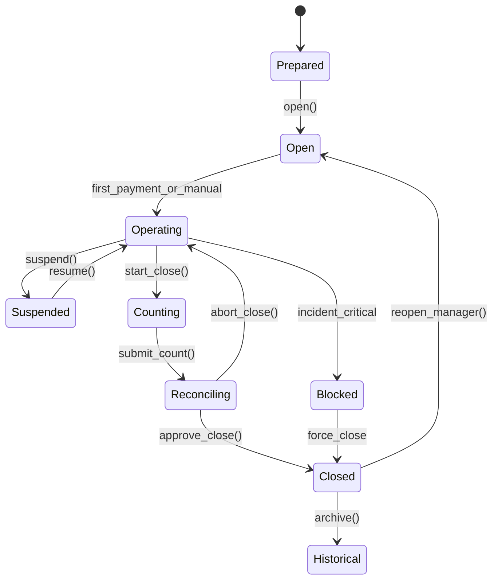

# 13 — STATE MACHINE

---

# CashRegister states

| Estado | Descripción |
|--------|-------------|
| **NotConfigured** | Branch sin registers (onboarding) |
| **Prepared** | Register creado, nunca usado |
| **Active** | IsActive=true, puede abrir sesiones |
| **Inactive** | Desactivado, histórico only |

(Register no tiene estado operativo — lo lleva la Session)

---

# CashSession states

| Estado | Código | Transiciones permitidas |
|--------|--------|-------------------------|
| **Prepared** | PREP | → Open (cancel) |
| **Open** | OPEN | → Operating, Suspended |
| **Operating** | OPER | → Suspended, Counting |
| **Suspended** | SUSP | → Operating, Counting (supervisor) |
| **Counting** | COUNT | → Reconciling |
| **Reconciling** | RECON | → Closed, Operating (abort count) |
| **Closed** | CLOSED | → Historical, Reopen (manager) |
| **Blocked** | BLOCK | → Closed (forced, manager+incident) |
| **Audited** | AUDIT | terminal (post external audit mark) |
| **Historical** | HIST | terminal immutable |

---

# CashApproval states

Pending → Approved | Rejected (terminal)

---

# CashIncident states

Open → Investigating → Resolved | Escalated

---

# Payment impact on session

Payment allowed when session in: **Open, Operating**  
Blocked when: **Counting, Reconciling, Closed, Blocked, Historical**

---

# Guards

- `close()`: requires CashCount Closing submitted  
- `reopen()`: requires manager + within time window  
- `suspend()`: supervisor+ or auto stale job  
