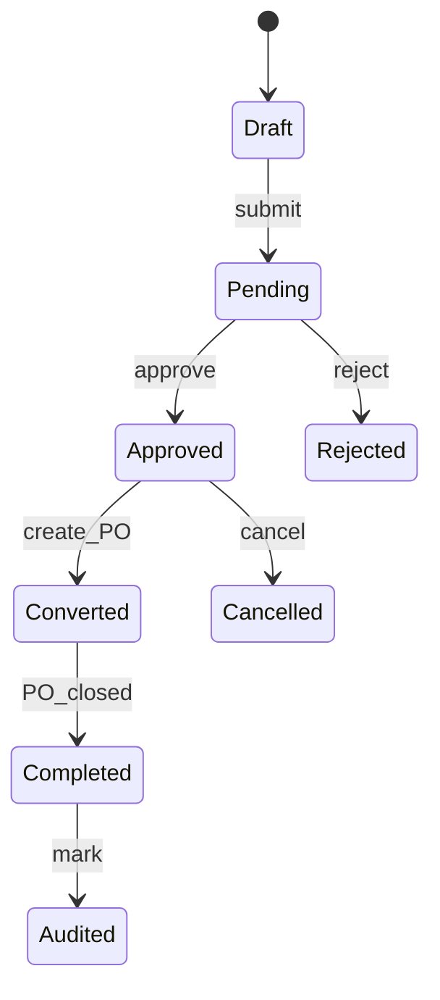

# 07 — PURCHASE REQUEST

---

# Propósito

Capturar **necesidad** antes del compromiso comercial.  
Orígenes: manual, MinStock alert, reorder job, conversión desde dashboard.

---

# Estados

| Estado | Transiciones |
|--------|--------------|
| Draft | → Pending, Cancelled |
| Pending | → Approved, Rejected |
| Approved | → Converted, Cancelled |
| Rejected | terminal |
| Cancelled | terminal |
| Converted | → Completed (cuando PO cerrado) |
| Completed | → Audited |
| Audited | terminal |

---

# Reglas

- Solo requester edita Draft  
- Approve: supervisor+ o PurchasingAccess según monto  
- Convert: crea PO Draft/PendingApproval con líneas copiadas  
- No genera stock ni costo  

---

# Campos línea

product_id, qty, UOM, station_id (destino recepción), preferred_supplier_id?, estimated_cost, notes
