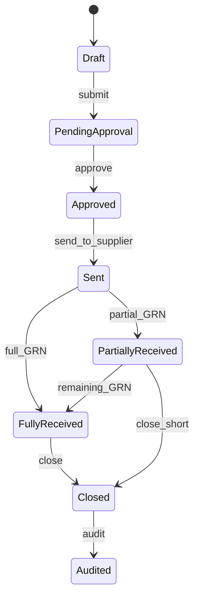

# 08 — PURCHASE ORDER

---

# Estados

| Estado | Código | Transiciones |
|--------|--------|--------------|
| Draft | DFT | → PendingApproval, Cancelled |
| PendingApproval | PAP | → Approved, Rejected→Draft, Cancelled |
| Approved | APR | → Sent, Cancelled |
| Sent | SNT | → PartiallyReceived, FullyReceived, Cancelled |
| PartiallyReceived | PRP | → FullyReceived, Closed, Returned |
| FullyReceived | FRV | → Closed |
| Closed | CLS | → Audited |
| Cancelled | CAN | terminal (si qty_received=0) |
| Returned | RET | → Closed |
| Audited | AUD | terminal |

---

# Guards

- `submit`: ≥1 línea, supplier Active/Preferred, totals > 0  
- `approve`: dual approval si total ≥ umbral (default $500 / configurable)  
- `send`: status Approved  
- `receive`: status Sent | PartiallyReceived  
- `cancel`: qty_received == 0 en todas las líneas  
- `close`: FullyReceived OR (Partially + manager short-close + reason)  

---

# Numeración

`PO-{BranchCode}-{yyyy}-{seq}` único por Company.

---

# Líneas

quantity_ordered, quantity_received (acumulado), unit_price locked al Approved,  
line_total = qty_ordered × unit_price (commitment), station_id destino.
