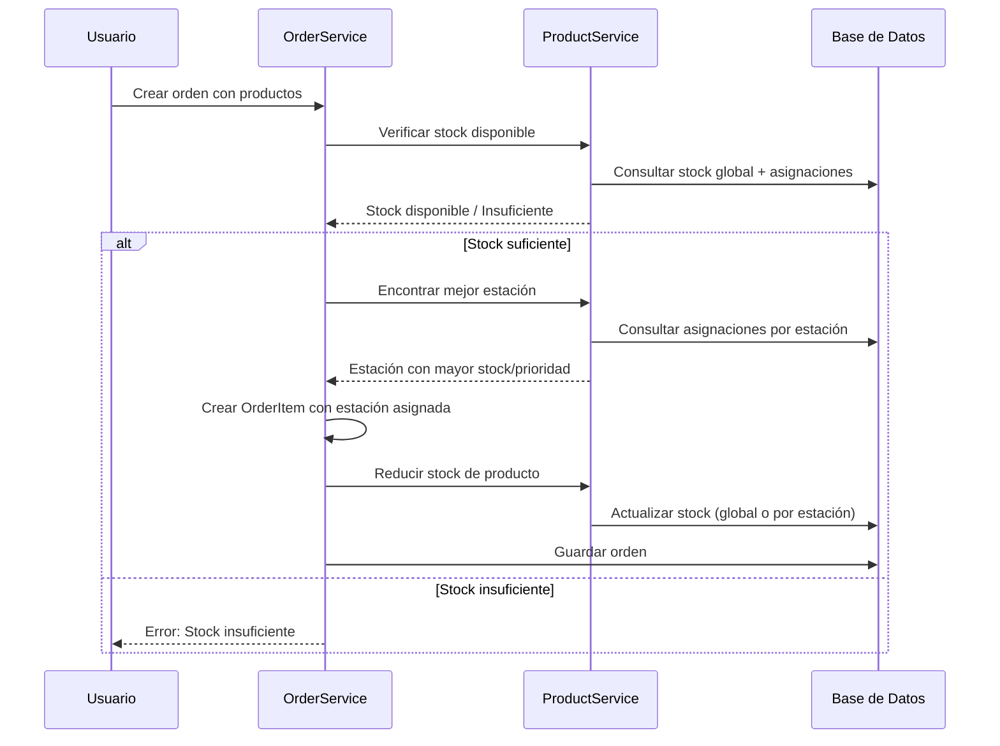

# Sistema de Inventario y Asignación Inteligente de Estaciones

## 📋 Resumen

Sistema completo de gestión de inventario que permite:
- **Trackear stock disponible** por producto
- **Asignar productos a diferentes estaciones** basándose en disponibilidad de stock
- **Reducir stock automáticamente** cuando se agrega un producto a una orden
- **Restaurar stock** cuando se cancela una orden
- **Alertas de stock bajo** mediante configuración de stock mínimo

## 🏗️ Arquitectura

### Modelos Nuevos

#### 1. **ProductStockAssignment**
Modelo que permite asignar stock de un producto a diferentes estaciones:

```csharp
public class ProductStockAssignment : ITrackableEntity
{
    public Guid Id { get; set; }
    public Guid ProductId { get; set; }
    public Guid StationId { get; set; }
    public decimal Stock { get; set; }              // Stock disponible en esta estación
    public decimal? MinStock { get; set; }           // Stock mínimo para alertas
    public int Priority { get; set; }                // Prioridad de asignación (mayor = más prioridad)
    public bool IsActive { get; set; }
    // ... campos multi-tenant y auditoría
}
```

**Características:**
- Un producto puede tener stock en múltiples estaciones
- Cada asignación tiene su propio stock independiente
- Sistema de prioridades para asignación automática
- Soporte multi-tenant (CompanyId, BranchId)

#### 2. **Product - Campos Nuevos**

```csharp
public partial class Product : ITrackableEntity
{
    // ... campos existentes
    
    // ✅ NUEVO: Campos de inventario
    public decimal? Stock { get; set; }              // Stock global del producto
    public decimal? MinStock { get; set; }          // Stock mínimo para alertas
    public bool TrackInventory { get; set; }        // Si se controla inventario
    public bool AllowNegativeStock { get; set; }    // Permitir stock negativo
    
    // ✅ NUEVO: Relación con asignaciones por estación
    public virtual ICollection<ProductStockAssignment> StockAssignments { get; set; }
}
```

## 🔄 Flujo de Trabajo

### 1. **Creación de Orden con Verificación de Stock**

Cuando se crea una orden con productos:



### 2. **Asignación Inteligente de Estaciones**

El sistema encuentra la mejor estación para un producto basándose en:

1. **Prioridad de asignación** (mayor número = mayor prioridad)
2. **Stock disponible** (mayor stock = mejor opción)
3. **Stock suficiente** (debe tener al menos la cantidad requerida)

**Algoritmo:**
```
1. Si el producto NO controla inventario → Usar estación predeterminada
2. Buscar asignaciones por estación con:
   - Stock >= cantidad requerida
   - IsActive = true
   - Misma sucursal (BranchId)
3. Ordenar por:
   - Prioridad DESC (mayor primero)
   - Stock DESC (mayor primero)
4. Si no hay asignaciones por estación pero hay stock global suficiente → Usar estación predeterminada
5. Si AllowNegativeStock = true → Permitir asignación aunque el stock sea insuficiente
6. Si no hay stock suficiente → Error
```

### 3. **Reducción de Stock**

Cuando se agrega un producto a una orden:

1. **Verificar stock disponible** antes de crear el item
2. **Encontrar mejor estación** con stock suficiente
3. **Asignar estación** al OrderItem (`PreparedByStationId`)
4. **Reducir stock**:
   - Si hay asignación por estación → Reducir stock de esa estación
   - Si no hay asignación por estación → Reducir stock global
   - Si no se controla inventario → Skip

### 4. **Restauración de Stock**

Cuando se cancela una orden:

1. **Iterar sobre todos los OrderItems** de la orden cancelada
2. **Restaurar stock** en la misma estación donde se redujo:
   - Si el item tiene `PreparedByStationId` → Restaurar stock de esa estación
   - Si no tiene estación asignada → Restaurar stock global
   - Si no se controla inventario → Skip

## 📊 Servicios y Métodos

### ProductService - Métodos Nuevos

#### `GetAvailableStockAsync(productId, branchId?)`
Obtiene el stock total disponible de un producto:
- Stock global del producto
- Suma de stock de todas las asignaciones por estación
- Retorna `-1` si no se controla inventario (stock ilimitado)

#### `GetStockInStationAsync(productId, stationId, branchId?)`
Obtiene el stock disponible de un producto en una estación específica.
Si no hay asignación específica, retorna stock global.

#### `FindBestStationForProductAsync(productId, requiredQuantity, branchId?)`
Encuentra la mejor estación para asignar un producto basándose en:
- Prioridad de asignación
- Stock disponible
- Cantidad requerida

**Retorna:**
- `Guid?` de la estación más adecuada
- `null` si no hay stock suficiente (y no se permite stock negativo)

#### `ReduceStockAsync(productId, quantity, stationId?, branchId?)`
Reduce el stock de un producto:
- Si `stationId` está especificado → Reduce stock de esa estación
- Si no hay asignación por estación → Reduce stock global
- Valida stock suficiente (a menos que `AllowNegativeStock = true`)

#### `RestoreStockAsync(productId, quantity, stationId?, branchId?)`
Restaura stock de un producto:
- Si `stationId` está especificado → Restaura stock de esa estación
- Si no hay asignación por estación → Restaura stock global

#### `HasStockAvailableAsync(productId, quantity, branchId?)`
Verifica si hay stock suficiente para una cantidad requerida.

### OrderService - Integración

#### `AddOrUpdateOrderWithPendingItemsAsync(dto, userId)`

**Mejoras implementadas:**

1. **Verificación de stock antes de crear items:**
   ```csharp
   if (product.TrackInventory)
   {
       var hasStock = await _productService.HasStockAvailableAsync(...);
       if (!hasStock) throw new InvalidOperationException("Stock insuficiente");
   }
   ```

2. **Asignación inteligente de estaciones:**
   ```csharp
   var bestStationId = await _productService.FindBestStationForProductAsync(
       product.Id, itemDto.Quantity, order.BranchId);
   newItem.PreparedByStationId = bestStationId ?? product.StationId;
   ```

3. **Reducción de stock después de agregar item:**
   ```csharp
   if (product.TrackInventory && assignedStationId.HasValue)
   {
       await _productService.ReduceStockAsync(
           product.Id, itemDto.Quantity, assignedStationId.Value, order.BranchId);
   }
   ```

#### `CancelOrderAsync(orderId, userId, reason, supervisorId)`

**Mejoras implementadas:**

1. **Restauración de stock al cancelar:**
   ```csharp
   foreach (var item in order.OrderItems)
   {
       await _productService.RestoreStockAsync(
           item.ProductId.Value,
           item.Quantity,
           item.PreparedByStationId,
           order.BranchId);
   }
   ```

## 🗄️ Base de Datos

### Nuevas Tablas

#### `product_stock_assignments`

```sql
CREATE TABLE product_stock_assignments (
    id UUID PRIMARY KEY DEFAULT gen_random_uuid(),
    product_id UUID NOT NULL REFERENCES products(id) ON DELETE CASCADE,
    station_id UUID NOT NULL REFERENCES stations(id) ON DELETE RESTRICT,
    stock DECIMAL(18,2) NOT NULL,
    min_stock DECIMAL(18,2),
    priority INTEGER DEFAULT 0,
    is_active BOOLEAN DEFAULT true,
    company_id UUID REFERENCES companies(id) ON DELETE CASCADE,
    branch_id UUID REFERENCES branches(id) ON DELETE CASCADE,
    created_at TIMESTAMP WITH TIME ZONE DEFAULT CURRENT_TIMESTAMP,
    updated_at TIMESTAMP WITH TIME ZONE DEFAULT CURRENT_TIMESTAMP,
    created_by VARCHAR(255),
    updated_by VARCHAR(255),
    CONSTRAINT ix_product_stock_assignments_unique UNIQUE (product_id, station_id, branch_id)
);
```

### Campos Nuevos en `products`

```sql
ALTER TABLE products ADD COLUMN stock DECIMAL(18,2);
ALTER TABLE products ADD COLUMN min_stock DECIMAL(18,2);
ALTER TABLE products ADD COLUMN track_inventory BOOLEAN DEFAULT false;
ALTER TABLE products ADD COLUMN allow_negative_stock BOOLEAN DEFAULT false;
```

## 🎯 Casos de Uso

### Caso 1: Producto con Stock en Múltiples Estaciones

**Escenario:**
- Producto: "Pizza Margherita"
- Estación A (Cocina Principal): Stock = 10, Prioridad = 5
- Estación B (Cocina Express): Stock = 5, Prioridad = 3
- Orden requiere: 3 unidades

**Resultado:**
- Sistema asigna a Estación A (mayor prioridad y stock suficiente)

### Caso 2: Producto con Stock Insuficiente en Todas las Estaciones

**Escenario:**
- Producto: "Hamburguesa Clásica"
- Estación A: Stock = 2
- Estación B: Stock = 1
- Orden requiere: 5 unidades
- AllowNegativeStock = false

**Resultado:**
- Error: "Stock insuficiente. Disponible: 3, Requerido: 5"

### Caso 3: Producto que Permite Stock Negativo

**Escenario:**
- Producto: "Bebida del Día"
- Stock global: 1
- Orden requiere: 5 unidades
- AllowNegativeStock = true

**Resultado:**
- Sistema permite la orden
- Stock queda en -4
- Se asigna a estación predeterminada

### Caso 4: Cancelación de Orden con Restauración de Stock

**Escenario:**
- Orden cancelada con:
  - Item 1: 3 unidades de Pizza (Estación A)
  - Item 2: 2 unidades de Hamburguesa (Estación B)

**Resultado:**
- Se restaura stock en Estación A: +3
- Se restaura stock en Estación B: +2

## ⚙️ Configuración

### Activar Control de Inventario para un Producto

1. **Desde el Frontend:**
   - `TrackInventory = true`
   - `Stock = cantidad inicial`
   - `MinStock = cantidad mínima para alertas`

2. **Configurar Stock por Estación:**
   - Crear `ProductStockAssignment` para cada estación
   - Asignar `Stock`, `MinStock`, y `Priority`

### Desactivar Control de Inventario

- `TrackInventory = false`
- El producto no verificará ni reducirá stock

## 📝 Logs y Debugging

Todos los métodos incluyen logs detallados con emojis:

- 🔍 = Inicio de operación
- ✅ = Operación exitosa
- ❌ = Error
- ⚠️ = Advertencia
- 📊 = Estadísticas/conteos

**Ejemplo de logs:**
```
🔍 [ProductService] FindBestStationForProductAsync() - ProductId: xxx, RequiredQuantity: 5
✅ [ProductService] Estación seleccionada: yyy (Prioridad: 5, Stock: 10)
✅ [OrderService] Estación asignada para Pizza: yyy
✅ [ProductService] ReduceStockAsync() - Stock reducido en estación: 10 -> 5
```

## 🔮 Mejoras Futuras

1. **Alertas de Stock Bajo:**
   - Notificaciones cuando `Stock < MinStock`
   - Dashboard de inventario con productos con stock bajo

2. **Historial de Movimientos:**
   - Tabla `stock_movements` para trackear todos los cambios
   - Reportes de consumo por producto/estación

3. **Reabastecimiento Automático:**
   - Sugerencias de compra cuando `Stock < MinStock`
   - Integración con proveedores

4. **Transferencias entre Estaciones:**
   - Mover stock de una estación a otra
   - Historial de transferencias

5. **Lotes y Fechas de Vencimiento:**
   - Tracking por lotes
   - Alertas de productos próximos a vencer

## ✅ Verificación

Para verificar que el sistema funciona:

1. **Crear producto con inventario:**
   - `TrackInventory = true`
   - `Stock = 10`

2. **Crear orden con el producto:**
   - Cantidad: 5
   - Verificar que el stock se reduce a 5

3. **Cancelar la orden:**
   - Verificar que el stock se restaura a 10

4. **Asignar stock a diferentes estaciones:**
   - Estación A: Stock = 5, Prioridad = 5
   - Estación B: Stock = 3, Prioridad = 3
   - Crear orden con cantidad 2
   - Verificar que se asigna a Estación A

## 📚 Referencias

- `Models/Product.cs` - Modelo de producto con campos de inventario
- `Models/ProductStockAssignment.cs` - Modelo de asignación de stock por estación
- `Services/ProductService.cs` - Métodos de gestión de inventario
- `Services/OrderService.cs` - Integración de inventario en creación de órdenes
- `Models/RestBarContext.cs` - Configuración de entidades en Entity Framework

